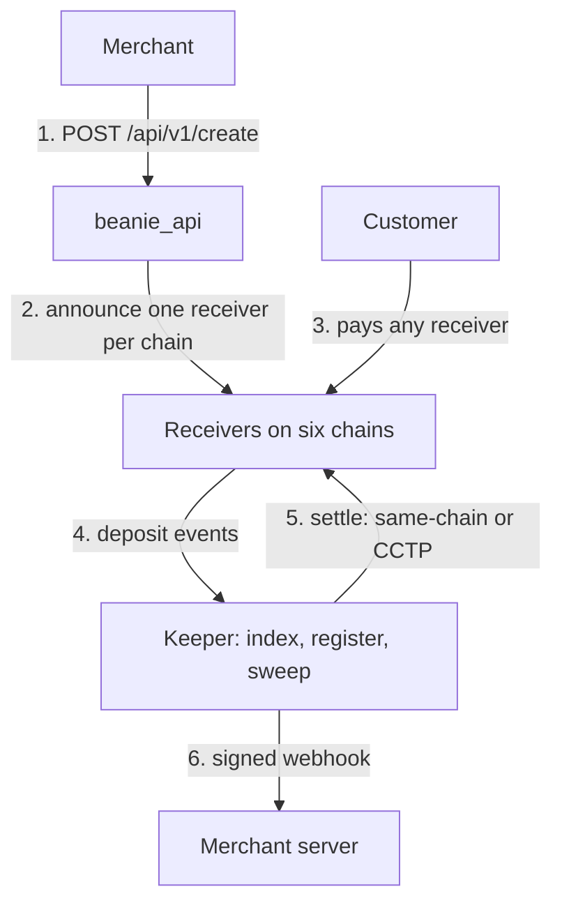
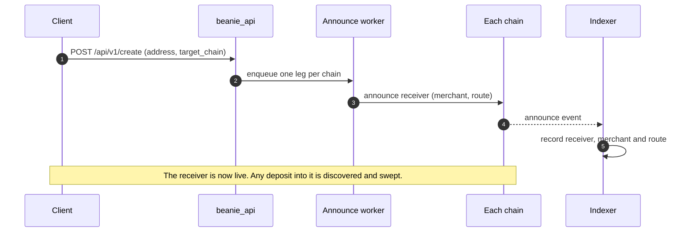
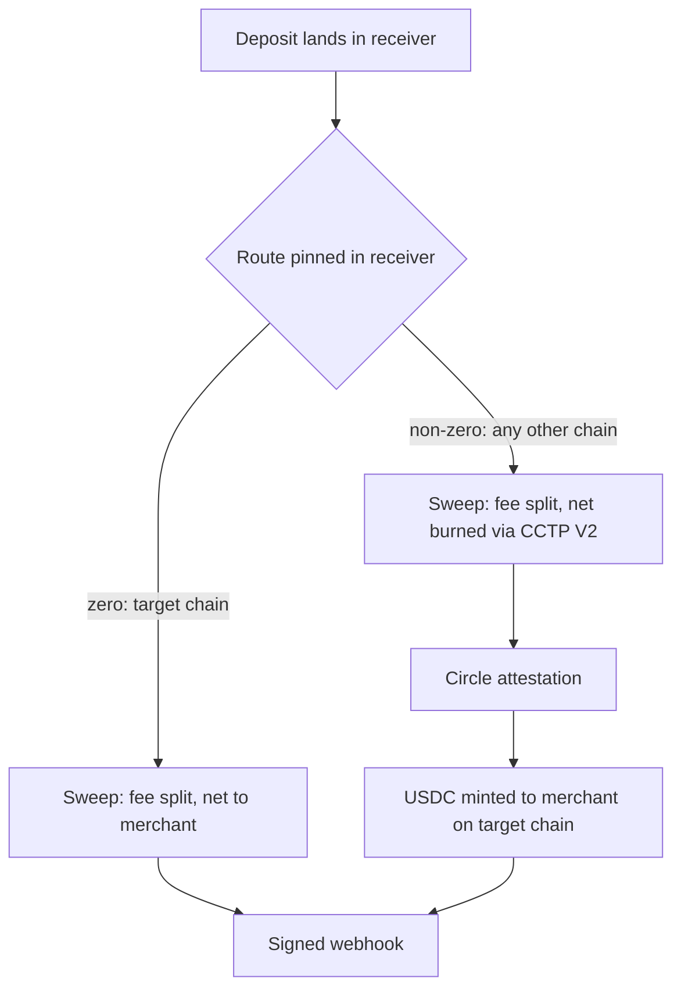
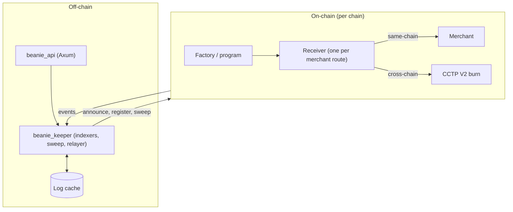
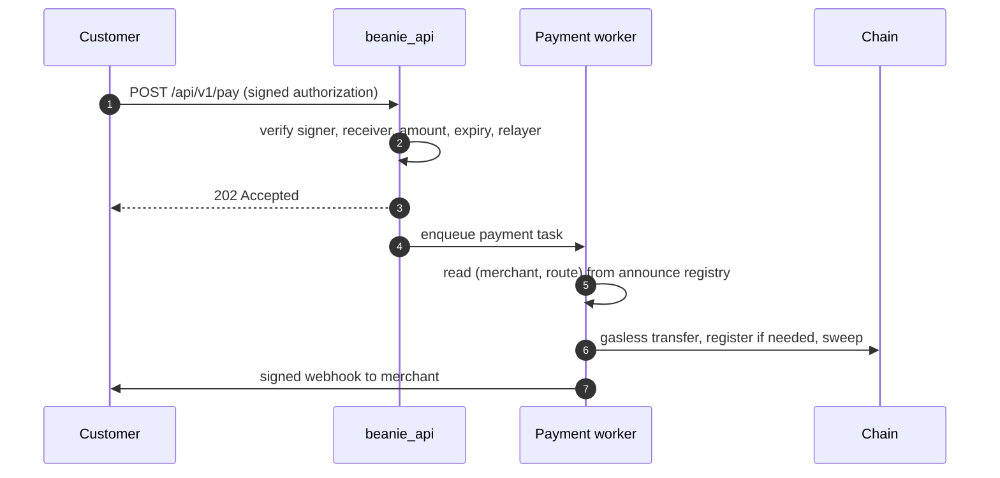

# Beanie

**A multichain API gateway for stablecoin payment intents.**

Give Beanie one address on one chain. Beanie provisions a dedicated, non-custodial receiving address on each supported chain. A customer can pay on any of those chains and the merchant is settled on the chain they chose, either directly or through Circle CCTP V2.

Beanie never holds merchant funds. Settlement rules are fixed on-chain when a receiver is created, and no admin key can redirect them afterwards.

---

## Contents

1. [Key capabilities](#key-capabilities)
2. [How it works](#how-it-works)
3. [Quickstart](#quickstart)
4. [API reference](#api-reference)
5. [Webhooks](#webhooks)
6. [Settlement and fees](#settlement-and-fees)
7. [Architecture](#architecture)
8. [Security model](#security-model)
9. [Running locally](#running-locally)
10. [Repository layout](#repository-layout)
11. [Testing](#testing)

---

## Key capabilities

| Capability | Description |
|---|---|
| **One integration, six chains** | Base, Ethereum, Arbitrum, Monad, Starknet and Solana. |
| **Non-custodial** | Funds lands in a per-merchant receiver contract or program account. Beanie only relays transactions. |
| **Pinned settlement** | The destination chain and address are part of the receiver's identity. They cannot be changed later. |
| **Permissionless sweep** | Anyone can trigger a sweep, and a sweep on an empty receiver does nothing. |
| **Gasless payments** | A customer signs an authorization and Beanie's keeper pays the gas. |
| **Signed webhooks** | Deposit and settlement notifications are signed and retried. |
| **Stealth payments** | Optional Passkey/TEE-secured accounts that separate the merchant from the audit trail. |

---

## How it works



### The model in one paragraph

You create a **payment route** with a single `address` and a `target_chain`. Beanie creates one **receiver** per chain. Each receiver has a pinned route:

- If the receiver's chain is the target chain, the route is **same-chain** and the net amount is transferred to the merchant.
- On every other chain, the route is **cross-chain** and the net amount is burned through CCTP V2 and minted to the merchant on the target chain.

Money that arrives at any receiver ends up with the merchant on the target chain.

### Lifecycle



### What happens to a deposit



A deposit reaches a sweep in one of two ways:

| Path | Trigger |
|---|---|
| **Indexed deposit** | The indexer sees a transfer into a known receiver, and the transfer worker registers the receiver if needed and sweeps it. |
| **Gasless payment** | The customer signs a transfer, `POST /api/v1/pay` validates it, and the payment worker submits the transfer and sweeps in the same step. |

---

## Quickstart

### 1. Create a route

```bash
curl -X POST https://<host>/api/v1/create \
  -H "Content-Type: application/json" \
  -d '{
        "address": "<merchant address>",
        "target_chain": "base"
      }'
```

The API returns `202 Accepted` while receiver announcements are queued; it does not return receiver addresses. The Beanie frontend derives predictable EVM/Starknet receivers locally and discovers the Solana receiver from its on-chain announcement. Share the receiver for the customer's chain once it is available.

### 2. Accept a payment

Either of the following works:

- The customer sends USDC directly to the receiver address on their chain. No API call is needed.
- The customer signs a gasless transfer and your app submits it to `POST /api/v1/pay` (see below).

### 3. Receive the webhook

Beanie posts a signed notification to your `webhook_url` after the deposit is swept.

---

## API reference

Base path: `/api/v1`. Requests and responses are JSON.

| Method | Path | Purpose |
|---|---|---|
| `POST` | `/create` | Create a payment route and its receivers. |
| `POST` | `/pay` | Submit a signed gasless payment. |
| `POST` | `/stealth/claim` | Spend a stealth payment. |
| `GET` | `/stealth/cosigners` | Discover configured TEE cosigner identities and their attestation commitment. |
| `POST` | `/webauthn/register/start`, `/register/finish` | Passkey registration. |
| `POST` | `/webauthn/auth/start`, `/auth/finish` | Passkey authentication. |
| `GET` | `/health` (no `/api/v1` prefix) | Liveness check, returns `ok`. |

### `POST /api/v1/create`

| Field | Type | Description |
|---|---|---|
| `address` | string | The merchant's address on the target chain. |
| `target_chain` | string | Where the merchant is settled. |

The address is parsed for each chain. Where it isn't valid on a chain (for example an EVM address on Solana), Beanie derives a chain-appropriate merchant identity. The original address on `target_chain` is always the final destination.

### `POST /api/v1/pay`

Submits a gasless payment. The customer's signed authorization is checked before anything is sent on-chain.

| Field | Type | Description |
|---|---|---|
| `chain` | string | Chain the customer is paying from. |
| `merchant_address` | string | Merchant address. |
| `receiver_address` | string | Receiver address on `chain`. |
| `destination_chain` | string | The route's target chain. |
| `tx_hash` | string | Client-side reference for the payment. |
| `from_address` | string | Payer address. |
| `amount_raw` | string | Amount in base units, as an integer string. |
| `webhook_url` | string, optional | Where to notify after settlement. |
| `signature` | string | JSON-encoded signature payload, whose `kind` depends on the chain. |

The `signature` payload depends on the chain:

| `kind` | Chain | Contents |
|---|---|---|
| `evm` | Base | An ERC-3009 `transferWithAuthorization`: `from`, `to`, `value`, `validAfter`, `validBefore`, `nonce`, `signature`. |
| `starknet` | Starknet | A SNIP-9 outside execution: `outsideExecution`, `signature[]`, `userAddress`. |
| `solana` | Solana | A base64 `message` with Beanie's keeper as fee payer, plus `signature` and `owner`. |

**Example (EVM)**

```bash
curl -X POST https://<host>/api/v1/pay \
  -H "Content-Type: application/json" \
  -d '{
        "chain": "base",
        "merchant_address": "0xMerchant...",
        "receiver_address": "0xReceiver...",
        "destination_chain": "base",
        "tx_hash": "order-1042",
        "from_address": "0xPayer...",
        "amount_raw": "25000000",
        "webhook_url": "https://merchant.example/hooks/beanie",
        "signature": "{\"kind\":\"evm\",\"from\":\"0xPayer...\",\"to\":\"0xReceiver...\",\"value\":\"25000000\",\"validAfter\":0,\"validBefore\":1893456000,\"nonce\":\"0x...\",\"signature\":\"0x...\"}"
      }'
```

**Responses**

| Status | Meaning |
|---|---|
| `202 Accepted` | The payment was validated and queued. |
| `400 Bad Request` | A required field is missing or malformed, or the signature check failed. The body says which. |
| `429 Too Many Requests` | Per-IP or per-receiver rate limit exceeded. |
| `503 Service Unavailable` | The payment queue is unavailable. Retry. |

Validation binds the signed authorization to the request. The payer, receiver, amount and expiry must all match what was signed, and the keeper must be the relayer or fee payer. A mismatch is rejected before submission.

### Stealth lanes and claims

A private lane derives one client signing key from the lane's passkey PRF. Its payout address is bound to that client and the provider-derived TEE cosigner:

| Family | Account and claim authorization |
|---|---|
| EVM | The configured `StealthAccountFactory` derives the account from `(client, cosigner, salt)`. A claim signs a USDC EIP-3009 `TransferWithAuthorization`: `tx_hash` is its EIP-712 digest `D`, and the client signs EIP-191(`D`). The worker co-signs, creates the account if needed, then submits the authorization atomically. This claim path uses ERC-1271 and does not use ERC-4337, an EntryPoint, or a paymaster. |
| Starknet | The account address is derived from the class hash, deployment salt, client STARK public key, and provider-derived Ethereum cosigner address. A claim contains an allowlisted USDC `transfer` call and a native INVOKE V3 hash signed by the client; the worker co-signs and deploys via the UDC if needed. |
| Solana | The client key and provider-derived Ed25519 cosigner determine a seeded SPL multisig account. A claim is one USDC `TransferChecked` message signed by the client; the worker adds the cosigner signature and keeper fee-payer signature. |

Before creating a private lane, the frontend calls `GET /api/v1/stealth/cosigners` and uses the provider's returned cosigner (plus EVM factory or Solana fee payer) to derive the account. Those values are stored in the browser lane record and backup so the same address can be re-derived later. This design trusts the provider to operate its configured key source honestly and reliably; the API does not compare against a separate, hardcoded expected-cosigner pin. The response includes `report_data`, a commitment over the public identity list for runtimes that support verifying it against an attestation.

The browser builds each family-specific claim, checks it locally, and asks for a second passkey assertion bound to `claim:{chain}:{derived_address}:{tx_hash}` before submission. The API recomputes the hash and validates the request before enqueueing it. Claims sweep the full lane balance to one destination. The API response echoes the signing hash as `transaction_hash`; it is not the relayed chain transaction hash. There is no claim-status endpoint, so the frontend checks the lane balance after enqueueing.

EVM claim prechecks require a nonzero value, an unused authorization nonce, a destination different from the account, a valid time window (at least 120 seconds remaining and within the configured maximum), and a token domain separator matching the token. Starknet calls and fee bounds are allowlisted and capped by `max_fee_fri`. Solana claims are limited to one canonical legacy message containing one allowlisted-mint `TransferChecked`, with the keeper as fee payer and the expected client/cosigner signers.

### `GET /api/v1/stealth/cosigners`

Returns the runtime-derived public identity for each configured chain and the `report_data` commitment. Each entry contains `chain`, `algo`, `cosigner`, and optional `factory` (EVM) or `relayer` (Solana). It contains no private key. Clients use these values as the provider's configuration and save them with the lane; this is a provider-trust model, not an out-of-band pinning model.

### `POST /api/v1/stealth/claim`

All requests include `chain`, `tx_hash`, `derived_address`, `client_sig`, and `verified_token`. Optional family fields are:

| Family | Required payload | Signing hash |
|---|---|---|
| EVM | `auth3009` with `client`, `to`, `value`, `valid_after`, `valid_before`, `nonce`, and `salt`; send `calls: []`. `client_sig` is `{ "r1", "s1", "v?" }`. | EIP-712 EIP-3009 digest; client signature is over EIP-191(digest). |
| Starknet | `calls` (1..20) and `starknet` with `client_pubkey`, `deploy_salt`, `nonce`, `tip`, `l1_gas`, `l2_gas`, and `l1_data_gas`. `client_sig` is `{ "r1", "s1" }` using the client STARK key. | Native INVOKE V3 transaction hash. |
| Solana | `calls: []` and `message_bytes`, hex-encoded canonical legacy `Message` (maximum 1232 bytes). `client_sig` is `{ "sig_hex" }`. | `sha256(message_bytes)`. |

Starknet `calls` contain `contract_address`, `entrypoint`, and `calldata`. The API returns `202` when the validated claim is queued. `400` means precheck rejected the claim, `401` means the passkey token is missing/expired/mismatched, `429` is rate limiting, and `503` means claims are disabled or the queue is full. A queued response does not guarantee the worker later confirms the transaction.

---

## Webhooks

When a deposit is swept, Beanie sends a `POST` to the merchant's `webhook_url`.

**Payload:** the deposit (`tx_hash`, `from_address`, `receiver`, `amount_raw`, `block_number`) and the `sweep_tx` that settled it.

**Headers**

| Header | Purpose |
|---|---|
| `X-Signature-Scheme` | How the payload was signed. The scheme depends on the deposit's origin chain. |
| `X-Signature` | The signature over the payload. |
| `X-Signer-Address` | The address to verify against. |
| `Idempotency-Key` | Stable per deposit. Use it to de-duplicate. |

**Delivery**

- Retries use exponential backoff.
- A `4xx` response is terminal and is not retried.
- Any other failure is retried.
- Make your handler idempotent, because delivery is at-least-once.

---

## Settlement and fees

The rules are identical on every chain.

| | Value |
|---|---|
| Protocol fee | 0.50% (50 bps) of the gross amount |
| Fee split | 90% treasury, 10% to whoever calls `sweep` |
| Net amount | Gross minus fee |
| Same-chain route | Net amount transferred to the merchant |
| Cross-chain route | Net amount burned through CCTP V2 Fast Transfer |
| Finality threshold | 1000 (Fast Transfer) |

| CCTP max fee (ceiling) | EVM | Starknet | Solana |
|---|---|---|---|
| Basis points | 2 | 15 | 3 |

The CCTP fee ceiling and finality threshold are fixed in each receiver contract or program. Clients never supply them.

### Supported chains and CCTP domains

| Chain | CCTP domain |
|---|---|
| Ethereum | 0 |
| Arbitrum | 3 |
| Solana | 5 |
| Base | 6 |
| Monad | 15 |
| Starknet | 25 |

---

## Architecture



### Components

| Component | Role |
|---|---|
| **EVM contracts** (`ChainXReceiver`, `ReceiverFactory`, `WebhookRegistry`) | Deterministic per-merchant clones. `sweep()` takes the fee and then burns via CCTP or forwards to the merchant. The factory resolves the CCTP domain from a chain name. |
| **Starknet contracts** (`StarknetReceiver`, `ReceiverFactory`, `StealthAccount`) | The same receiver logic in Cairo, plus the 2-of-2 stealth account. |
| **Solana program** (Anchor) | Receiver PDAs bound to the full route, a pinned pre-signed registration transaction, and a permissionless `sweep` (same-chain transfer or CCTP `deposit_for_burn`). |
| **`beanie_api`** | HTTP layer. It validates requests, verifies payment authorizations, queues work, and serves the frontend. |
| **`beanie_keeper`** | Indexers and the relayer. It discovers announces and deposits, registers receivers just in time, sweeps, and delivers webhooks. |

### Data sources

| Chain | Event source |
|---|---|
| EVM chains and Solana | Subsquid Portal |
| Starknet | Starknet events RPC |

A persistent log cache checkpoints every scan, so a restart resumes where it left off. A periodic reconciliation pass re-checks known receivers' balances directly, so a failed sweep is retried and not lost.

### Gasless payment flow



The worker takes `(merchant, route)` from the receiver's announce record. It never derives them from the payment request.

---

## Security model

| Property | How it is enforced |
|---|---|
| **No custody** | Funds sit in a receiver that only the pinned route can drain. Beanie holds no merchant keys. |
| **Route cannot change** | The route is part of the receiver's identity (a deterministic address on EVM and Starknet, PDA seeds on Solana). |
| **Keeper is only a relayer** | It pays gas and submits transactions. It cannot choose a destination. |
| **Announces are validated** | On Solana, an announce is re-derived and checked against the embedded registration transaction before it is trusted. A tampered or squatted announce is discarded. |
| **Payments are validated** | A gasless authorization is bound to the payer, receiver, amount and expiry before any transaction is sent. |
| **Idempotent sweeps** | An empty receiver is a no-op, and duplicate sweeps are harmless. |
| **Rate limiting** | Per-IP and per-receiver limits on the public endpoints. |

### Stealth payments (optional)

Private lanes keep the payout account and signing key out of the merchant's ordinary payment address. The passkey PRF derives the client key locally; a per-chain TEE cosigner is fixed into each account or multisig address. The server stores neither the lane secret nor the client private key. The browser stores public lane metadata and a derivation snapshot so imported lanes can be checked against their original parameters.

---

## Running locally

### Prerequisites

Rust (stable), Foundry, Scarb 2.17.0, and the Anchor toolchain.

### Configure

```bash
cd beanie_api
cp .env.example .env
```

Each chain has its own RPC URL, keeper key and contract addresses. For Solana:

| Variable | Purpose |
|---|---|
| `SOLANA_PROGRAM_ID` | Deployed Beanie program. |
| `SOLANA_MINT` | USDC mint. |
| `SOLANA_KEEPER_PRIVATE_KEY` | Relayer keypair (JSON array or base58). |
| `SOLANA_RPC_URL` | RPC for state reads and transaction submission. |
| `SOLANA_REGISTRY_START_SLOT`, `SOLANA_DEPOSIT_START_SLOT` | First slot to index. |
| `SOLANA_SUBSQUID_PORTAL_URL`, `SOLANA_SUBSQUID_PORTAL_API_KEY` | Event source. |

The treasury token account is read from the on-chain factory config at startup. It is not an environment variable.

The keeper wallet needs a USDC token account, which receives the caller share of the fee.

### Run

```bash
cd beanie_api
cargo run
```

This starts the API, the workers and the static frontend in one process. The checked-in stealth config uses dstack key sources and requires the dstack guest-agent socket. A normal local run without that socket will not initialize those cosigners; use a separate local config with `key_source.dev_env` and `ALLOW_DEV_KEYS=1` only for development.

### Build the contracts

```bash
# Starknet
cd starknet_beanie && scarb build

# EVM
cd evm_beanie && forge install && forge build

# Solana
cd solana_beanie && anchor build
```

---

## Repository layout

| Path | Contents |
|---|---|
| `evm_beanie/` | Solidity contracts: receiver, factory, webhook registry. |
| `starknet_beanie/` | Cairo contracts: receiver, factory, stealth account. |
| `solana_beanie/` | Anchor program and its TypeScript tests. |
| `beanie_keeper/` | Indexers, keepers, log cache, config. |
| `beanie_api/src/` | Axum server, request validation, workers. |
| `beanie_api/public/` | Frontend: lane creation, payment page, stealth claim. |

---

## Testing

```bash
forge test          # EVM: clones, CCTP vs same-chain, idempotency, limits
scarb test          # Starknet: receiver, factory, stealth account
anchor test         # Solana: registration, sweep, validation paths
cargo check         # keeper and API
```
