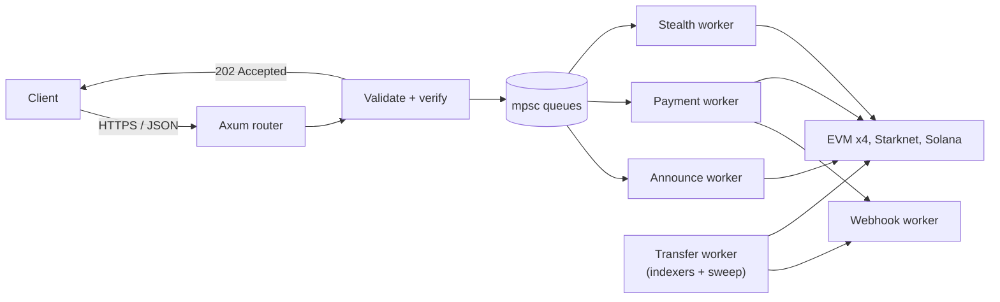
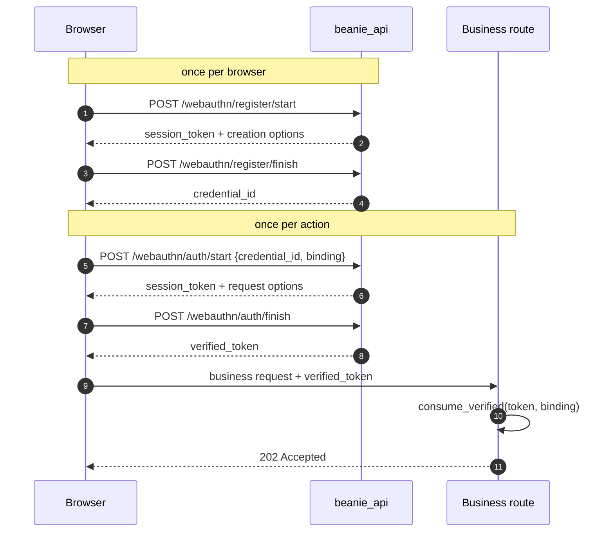
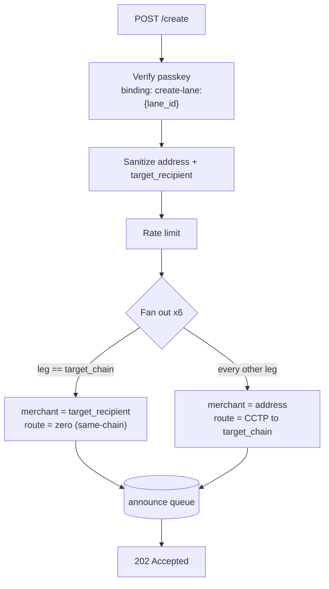
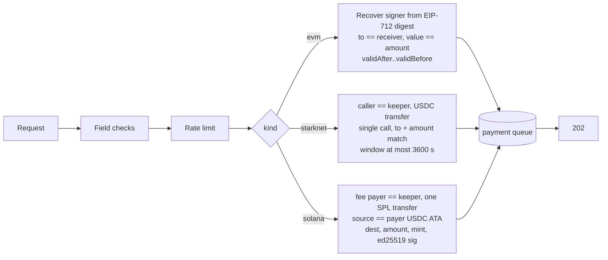
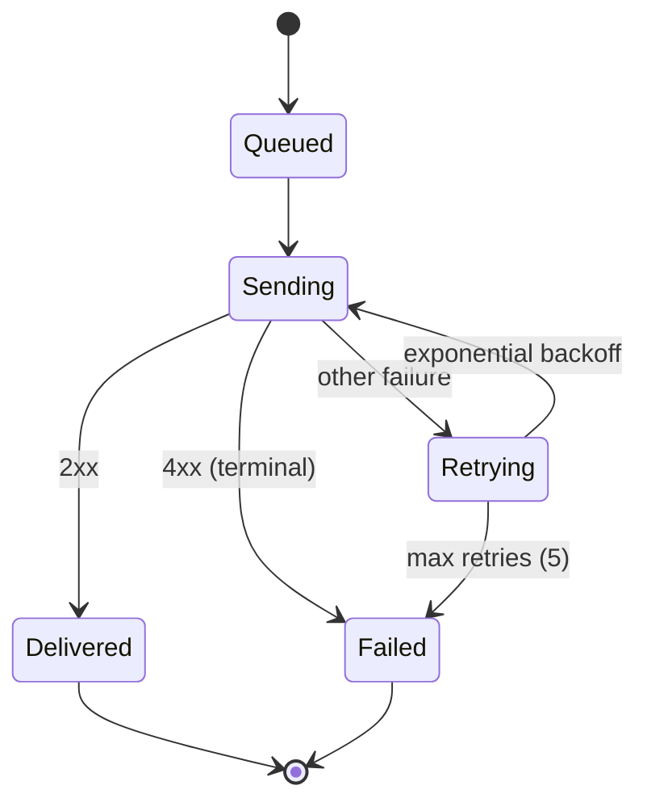

# Beanie API

**HTTP gateway for Beanie stablecoin payment routes.** A single Rust (Axum) process that validates requests, verifies authorizations, queues on-chain work, and serves the static frontend.

The API is the convenience layer. Receivers are created and swept on-chain by background workers, and no merchant funds ever pass through the API. See the [project README](../README.md) for the protocol, contracts and settlement rules.

---

## Contents

1. [Overview](#overview)
2. [Conventions](#conventions)
3. [Authentication (passkey ceremony)](#authentication-passkey-ceremony)
4. [Endpoints](#endpoints)
5. [Rate limiting](#rate-limiting)
6. [Workers and queues](#workers-and-queues)
7. [Configuration](#configuration)
8. [Running](#running)
9. [Known limitations](#known-limitations)

---

## Overview



The API follows an **accept, then process** model. Every write endpoint checks the request, enqueues a task and returns `202 Accepted`. The result of the on-chain work is delivered by signed webhook, not in the HTTP response.

| Chain family | Chains |
|---|---|
| EVM | Base, Ethereum, Arbitrum, Monad |
| Starknet | Starknet |
| Solana | Solana |

---

## Conventions

| Topic | Rule |
|---|---|
| Base path | `/api/v1` (except `/health`) |
| Format | `application/json` request and response bodies |
| Chain identifiers | Lowercase strings matching the `Chain` enum: `base`, `ethereum`, `arbitrum`, `monad`, `starknet`, `solana` |
| Amounts | Integer strings in token base units (USDC has 6 decimals) |
| Addresses | Validated and canonicalized per chain: EVM hex, Starknet felt, Solana base58 |
| Success | `202 Accepted` for queued work, `200 OK` for reads and ceremony steps |
| Errors | Standard HTTP status codes (RFC 9110) with a JSON message body |
| Delivery | Webhooks are at-least-once, so handlers must be idempotent |

### Status codes used

| Code | Meaning |
|---|---|
| `200` | Ceremony step or read succeeded. |
| `202` | Request validated and queued. |
| `400` | Malformed field, failed validation or failed signature check. |
| `401` | Passkey verification missing, expired, or bound to a different action. |
| `409` | Unknown credential. The client must register a new passkey (`refresh_credential`). |
| `429` | Rate limit exceeded. |
| `500` | Internal failure (for example the claim worker is not running). |
| `503` | Queue full or unavailable, or the feature is disabled. Retry later. |

---

## Authentication (passkey ceremony)

State-changing actions that are not themselves signed by the payer (`create`, `stealth/claim`) require a **WebAuthn passkey assertion** (W3C WebAuthn, via `webauthn-rs`). The assertion is bound to one specific action through a `binding` string, so a token minted for one action cannot be replayed on another.



### Bindings

| Action | Binding string |
|---|---|
| Create a route | `create-lane:{lane_id}` |
| Stealth claim | `claim:{chain}:{derived_address}:{tx_hash}` |

`/pay` does not use a passkey. It is authorized by the payer's own signed transfer.

### Token lifetimes

| Item | TTL |
|---|---|
| Registration ceremony | 120 s |
| Authentication ceremony | 120 s |
| `verified_token` | 60 s |
| `verified_token` uses | `max_uses` from `auth/start` (default 1, clamped to 1..4) |

A redemption requires an exact (case-insensitive) binding match and a live TTL. After the last use the token is deleted.

---

## Endpoints

| Method | Path | Auth | Purpose |
|---|---|---|---|
| `GET` | `/health` | none | Liveness. Returns `ok`. |
| `POST` | `/api/v1/webauthn/register/start` | none | Begin passkey registration. |
| `POST` | `/api/v1/webauthn/register/finish` | none | Complete passkey registration. |
| `POST` | `/api/v1/webauthn/auth/start` | credential | Begin an action-bound assertion. |
| `POST` | `/api/v1/webauthn/auth/finish` | credential | Complete it and receive a `verified_token`. |
| `POST` | `/api/v1/create` | `verified_token` | Announce receivers on all six chains. |
| `POST` | `/api/v1/pay` | payer signature | Submit a gasless payment. |
| `POST` | `/api/v1/stealth/claim` | `verified_token` + client signature | Spend a stealth payment. |

Any other path falls through to the static frontend handler.

### WebAuthn

| Endpoint | Request | Response |
|---|---|---|
| `register/start` | none | `{ session_token, options }` |
| `register/finish` | `{ session_token, credential }` | `{ credential_id }` |
| `auth/start` | `{ credential_id, binding, max_uses? }` | `{ session_token, options }` |
| `auth/finish` | `{ session_token, credential }` | `{ verified_token }` |

`options` and `credential` are the standard WebAuthn `PublicKeyCredential*` JSON structures, passed straight to and from `navigator.credentials`.

| Error | Cause |
|---|---|
| `400` | Unknown or expired session token. |
| `401` | Attestation or assertion failed verification. |
| `409` | `auth/start` with an unknown `credential_id`. Register again. |

---

### `POST /api/v1/create`

Creates a payment route. One request fans out into **six announce tasks**, one per supported chain. Each task announces a receiver whose settlement route is pinned on-chain.



**Request**

| Field | Type | Required | Description |
|---|---|---|---|
| `chain` | string | yes | Chain `address` belongs to. |
| `address` | string | yes | The proven identity, valid on `chain`. |
| `lane_id` | string | yes | Client-chosen id, 1..128 chars. Must match the passkey binding. |
| `verified_token` | string | yes | From `auth/finish`. |
| `target_chain` | string | yes | Chain the merchant is settled on. Equal to a leg's chain means same-chain. |
| `target_recipient` | string | yes | Merchant address on `target_chain`. Validated natively on that chain. |
| `webhook_url` | string | no | `http` or `https` URL with a host. Empty string is treated as none. |

`address` is only required to be valid on `chain`. On the other legs it is passed as an opaque string, and each worker either parses it natively or derives a chain-appropriate merchant identity. `target_recipient` is always the real payout destination.

```bash
curl -X POST https://<host>/api/v1/create \
  -H "Content-Type: application/json" \
  -d '{
        "chain": "base",
        "address": "0xMerchant...",
        "lane_id": "lane-7f3a",
        "verified_token": "<from auth/finish>",
        "target_chain": "base",
        "target_recipient": "0xMerchant...",
        "webhook_url": "https://merchant.example/hooks/beanie"
      }'
```

**Response `202`**

```json
{ "status": "accepted", "message": "Receiver announcement queued across all chains" }
```

The response does not contain receiver addresses. Receivers are announced asynchronously and appear in the on-chain registry once the announce transactions confirm.

| Error | Cause |
|---|---|
| `400` | Bad `lane_id`, address, settlement address or `webhook_url`. |
| `401` | Passkey token missing, expired, or bound to a different lane. |
| `429` | Rate limit exceeded. |
| `503` | No leg could be enqueued. Partial enqueue failures are logged and still return `202`. |

Announcing is an event-only call on every chain, so duplicate delivery of a leg is harmless.

---

### `POST /api/v1/pay`

Submits a **gasless payment**. The payer signs an authorization, the API verifies it and queues it, and the keeper pays gas and lands the transfer.

**Request**

| Field | Type | Required | Description |
|---|---|---|---|
| `chain` | string | yes | Chain the payer is paying from. |
| `merchant_address` | string | yes | Merchant address. |
| `receiver_address` | string | yes | Receiver address on `chain`. |
| `destination_chain` | string | yes | The route's target chain. |
| `tx_hash` | string | yes | Client-side reference for the payment. |
| `from_address` | string | yes | Payer address. |
| `amount_raw` | string | yes | Non-negative integer string. |
| `webhook_url` | string | no | Notification target after settlement. |
| `signature` | string | yes | JSON-encoded payload, tagged by `kind`. |

**`signature` payloads**

| `kind` | Chain | Standard | Fields |
|---|---|---|---|
| `evm` | Base, Ethereum, Arbitrum, Monad | ERC-3009 `transferWithAuthorization` | `from`, `to`, `value`, `validAfter`, `validBefore`, `nonce`, `signature` |
| `starknet` | Starknet | SNIP-9 outside execution | `outsideExecution`, `signature[]`, `userAddress` |
| `solana` | Solana | Signed legacy `Message` | `message` (base64), `signature` (base64), `owner` |

The `kind` must match `chain`, otherwise the request is rejected with `400`.

**Validation, before anything is queued**



| Check | EVM | Starknet | Solana |
|---|---|---|---|
| Signer equals `from_address` | yes | yes | yes |
| Destination equals `receiver_address` | yes | yes | yes |
| Amount equals `amount_raw` | yes | yes | yes |
| Validity window | `validAfter` to `validBefore` | `execute_after` to `execute_before`, at most 1 h | n/a |
| Keeper is relayer | n/a | `caller` | fee payer |
| Cryptographic proof | ECDSA recover | checked by the account on execution | ed25519 verify |

The payment worker takes `(merchant, route)` from the announce registry. It never derives them from the request.

```bash
curl -X POST https://<host>/api/v1/pay \
  -H "Content-Type: application/json" \
  -d '{
        "chain": "base",
        "merchant_address": "0xMerchant...",
        "receiver_address": "0xReceiver...",
        "destination_chain": "base",
        "tx_hash": "order-1042",
        "from_address": "0xPayer...",
        "amount_raw": "25000000",
        "webhook_url": "https://merchant.example/hooks/beanie",
        "signature": "{\"kind\":\"evm\",\"from\":\"0xPayer...\",\"to\":\"0xReceiver...\",\"value\":\"25000000\",\"validAfter\":0,\"validBefore\":1893456000,\"nonce\":\"0x...\",\"signature\":\"0x...\"}"
      }'
```

| Status | Meaning |
|---|---|
| `202` | Validated and queued. |
| `400` | Missing or malformed field, unsupported chain, or failed verification. The body says which. |
| `429` | Rate limit exceeded. |
| `503` | Payment queue unavailable. |

---

### `POST /api/v1/stealth/claim`

Spends a stealth payment. The **client signature** (`client_sig`) is the real on-chain spend authorization. The passkey is an anti-abuse gate, and the server holds no spending key. A TEE co-signer and the relayer complete the 2-of-2 gaslessly.

| Field | Type | Applies to | Description |
|---|---|---|---|
| `chain` | string | all | Must be enabled for claims. |
| `tx_hash` | string | all | Family-specific signing hash (see below). |
| `derived_address` | string | all | The stealth account being spent. |
| `client_sig` | object | all | `{ r1, s1, v? }` (ECDSA) or `{ sig_hex }` (Ed25519, 128 hex chars). |
| `verified_token` | string | all | Bound to `claim:{chain}:{derived_address}:{tx_hash}`. |
| `calls` | array | EVM, Starknet | `{ contract_address, entrypoint, calldata[] }`, 1..20 calls. Send `[]` on Solana. |
| `auth3009` | object | EVM | EIP-3009 parameters the client signed. |
| `starknet` | object | Starknet | Invoke-v3 hash inputs: pubkey, salt, nonce, tip, resource bounds. |
| `message_bytes` | string | Solana | Hex of the serialized legacy `Message`, at most 1232 bytes. |

| Family | `tx_hash` is |
|---|---|
| EVM | ERC-4337 v0.7 `userOpHash`. Client signs EIP-191 of it. |
| Starknet | Native INVOKE V3 transaction hash. |
| Solana | `sha256(message_bytes)`. |

The route runs the worker's own `precheck`. It recomputes the signing hash from the submitted calls, enforces allowlists and verifies the client signature where possible, so a bad claim fails with `400` now instead of silently in the worker.

**Response `202`**

```json
{
  "status": "queued",
  "message": "Claim validated and queued for co-signing and gasless relay.",
  "transaction_hash": "0x..."
}
```

`transaction_hash` echoes the canonical `tx_hash` you submitted. It is not the on-chain hash of the relayed transaction.

| Error | Cause |
|---|---|
| `400` | Bad shape, size limit exceeded, unsupported chain, or `precheck` rejected the claim. |
| `401` | Passkey token missing, expired, or bound to a different claim. |
| `429` | Rate limit exceeded. |
| `503` | Chain disabled for claims, or claim queue full (non-blocking `try_send`). |
| `500` | Claim worker is not running. |

---

## Webhooks

Webhooks are sent by the keeper, not by an API route. They are posted to the route's `webhook_url` after a deposit is swept.

| Part | Content |
|---|---|
| Body | The deposit (`tx_hash`, `from_address`, `receiver`, `amount_raw`, `block_number`) and the settling `sweep_tx` |
| `X-Signature-Scheme` | How the payload was signed. Depends on the deposit's origin chain. |
| `X-Signature` | Signature over the payload. |
| `X-Signer-Address` | Address to verify against. |
| `Idempotency-Key` | Stable per deposit. Use it to de-duplicate. |



---

## Rate limiting

One entry point, `RateLimiter::check`, is called once per handler, after the passkey (or payer) identity is established. Each call consumes one unit from **three independent fixed-window buckets**. The window is one hour, and any bucket over its limit returns `429`.

| Bucket | Key | Limit |
|---|---|---|
| IP | Client IP | `RATE_LIMIT_PER_HOUR` |
| Credential | Passkey `credential_id` (or `from::receiver` on `/pay`) | 32 |
| Address | Merchant or derived address (or receiver on `/pay`) | 8 |

The limiter is in-memory and per-process.

---

## Workers and queues

All queues are bounded Tokio `mpsc` channels created at startup.

| Queue | Capacity | Producer | Consumer |
|---|---|---|---|
| Announce | 2048 | `/create` | Announce worker: calls `announceReceiver` on each chain. On Solana it also prepares and announces the pre-signed registration. |
| Payment | 2048 | `/pay` | Payment worker: submits the gasless transfer and sweeps. |
| Stealth | 2048 | `/stealth/claim` | Stealth workers: Fireblocks co-sign, then relay. |
| Webhook | 4096 | Transfer and payment workers | Webhook worker: signed delivery with retries. |

The **transfer worker** has no queue. It runs one task per chain, indexing announces and deposits, registering receivers just in time, and sweeping. A periodic reconciliation pass re-checks known receivers' balances so a failed sweep is retried.

Registries are shared read-only with the payment worker, so payment routing always uses the announced `(merchant, route)`.

---

## Configuration

Loaded from the environment (`.env` is read automatically). Each chain has its own RPC URL, keeper key and contract addresses. Use `.env.example` as the authoritative list of variable names.

| Group | Variables |
|---|---|
| Server | `LISTEN_ADDR`, `RATE_LIMIT_PER_HOUR` |
| WebAuthn | Relying party id and origin (`rp_id`, `rp_origin`). The origin must match the browser origin. |
| EVM (per chain) | Prefixed `BASE`, `ETHEREUM`, `ARBITRUM`, `MONAD`: RPC URL, keeper key, factory, webhook registry, USDC token, Subsquid Portal URL and key, start blocks |
| Starknet | RPC URL, events RPC URL and key, keeper key and address, factory, token, start blocks |
| Solana | `SOLANA_PROGRAM_ID`, `SOLANA_MINT`, `SOLANA_KEEPER_PRIVATE_KEY`, `SOLANA_RPC_URL`, `SOLANA_REGISTRY_START_SLOT`, `SOLANA_DEPOSIT_START_SLOT`, `SOLANA_SUBSQUID_PORTAL_URL`, `SOLANA_SUBSQUID_PORTAL_API_KEY` |
| Stealth | `STEALTH_CHAINS_JSON` and the Fireblocks credentials |

Startup fails fast when configuration is unusable: a missing or invalid stealth chain list, duplicate vault or cosigner addresses, an EVM RPC reporting the wrong chain id, or an unreadable Solana factory config. The Solana treasury token account is read from the on-chain factory config, not from the environment.

---

## Running

```bash
cp .env.example .env     # fill in chain and keeper settings
cargo run                # API, workers and static frontend in one process

cargo build --release
./target/release/beanie-api
```

Prerequisites: Rust (stable), RPC access for every enabled chain, funded keeper wallets on each chain, and a keeper USDC token account on Solana.

```bash
curl https://<host>/health    # -> ok
```

### Static frontend

Unmatched routes are served from `public/`:

| Request | Result |
|---|---|
| `/` | `public/beanie.html` |
| `/name` | `public/name.html` if it exists, otherwise redirect to `/` |
| `/name.html` | Redirect to the clean URL `/name` |
| `/scripts/*`, `/styles/*`, `/assets/*`, or any path with an extension | The file, or `404` |

---

## Known limitations

| Area | Limitation |
|---|---|
| Passkeys | Stored in memory. A restart invalidates them and clients get `409 refresh_credential`. |
| State | Ceremonies, verified tokens and rate-limit counters are per-process, so the API cannot run as multiple instances without a shared store. |
| `create` | Returns only `202`. Receiver addresses are not in the response. |
| Webhooks | A deposit swept only by the reconciliation pass has no deposit record, so it produces no webhook. |

---

## Standards referenced

| Area | Standard |
|---|---|
| HTTP semantics | RFC 9110 |
| Passkeys | W3C WebAuthn (Level 2) |
| EVM gasless transfer | ERC-3009, EIP-712, EIP-191 |
| EVM account abstraction | ERC-4337 v0.7 |
| Starknet gasless execution | SNIP-9 (outside execution) |
| Cross-chain settlement | Circle CCTP V2 |
| Webhook de-duplication | `Idempotency-Key` header |