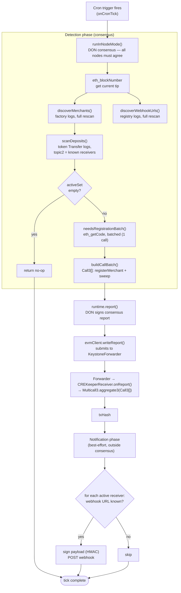

# Sweep Flow — CRE Keeper

A Chainlink CRE workflow that ports an existing Rust off-chain keeper's
EVM-side sweep logic onto CRE's Cron trigger + DON-consensus write path.
Every cycle it discovers merchants and webhook URLs, scans for stablecoin
deposits into known receiver addresses, bundles `registerMerchant` +
`sweep()` calls into a single Multicall3 batch, submits it as one signed
DON report, and fires best-effort webhook notifications for whatever
settled.

This document is both the design record (why the system is shaped this
way) and the operational reference (how to configure, run, and deploy it).

---

## What this system does

At a glance:

```
Cron trigger (onCronTick)
  │
  ├─ runInNodeMode()  ── runs under DON consensus, all nodes must agree ──
  │    1. eth_blockNumber                            → tip
  │    2. discoverMerchants()   (factory logs)        → receiver → merchant map
  │    3. discoverWebhookUrls() (registry logs)        → merchant → webhook URL map
  │    4. scanDeposits()        (token Transfer logs)   → active receiver set
  │    5. needsRegistrationBatch() (eth_getCode, batched) → which receivers are counterfactual
  │    6. buildCallBatch()      → Call3[] (registerMerchant + sweep per receiver)
  │
  ├─ runtime.report()       → DON reaches consensus, signs report
  ├─ evmClient.writeReport() → submits to CREKeeperReceiver via KeystoneForwarder
  │
  └─ Notification phase (best-effort, outside consensus)
       for each active receiver → sign payload (HMAC) → POST webhook
```



---

## On-chain contracts involved

**`ChainXReceiver.sol`** — one clone deployed per merchant. Immutable after
`initialize()`. Key entry point:

```solidity
function sweep() external returns (
    uint256 net, uint256 feeToCaller, uint256 feeToTreasury, uint256 fee
)
```

Permissionless, idempotent (zero balance → silent no-op, all-zero return).
Splits balance into fee (50 bps) and net; fee splits again 10% to the
caller / 90% to treasury; net either transfers same-chain to `merchant` or
burns via CCTP (`ITokenMessengerV2.depositForBurn`) depending on whether
`cctpMintRecipient` was set at `initialize()`. The caller-fee payout
targets `tx.origin` (not `msg.sender`) — relevant because every real sweep
call is routed through Multicall3, and `msg.sender` as seen by `sweep()`
would otherwise be Multicall3's own address, not the actual caller.

Events: `Initialized(...)`, `Swept(grossAmount, netAmount, feeAmount, feeToCaller, feeToTreasury)`.

**`MerchantFactory.sol`** — deploys `ChainXReceiver` clones via
`Clones.cloneDeterministic` (EIP-1167 minimal proxies, CREATE2). Key entry
points:

```solidity
function registerMerchant(address merchant, bytes32 cctpMintChain, bytes32 cctpMintRecipient) external returns (address)
function announceReceiver(address merchant) external // emits predicted address, no deploy
function predictReceiverAddress(address merchant) external view returns (address)
```

`registerMerchant` is deliberately unauthenticated — anyone can call it for
any merchant, supplying any CCTP params, first-call-wins. **This is an
intentional design choice, not an oversight** — see §6. Because deployment
cost is only paid once funds are already present (see §3),
`announceReceiver`/`predictReceiverAddress` let the keeper give out a
receiving address for free, before any contract exists there.

Events: `MerchantRegistered(address indexed merchant, address receiver)`,
`ReceiverAnnounced(address indexed merchant, address indexed receiver, uint256 nonce)`.

**`MerchantWebhookRegistry.sol`** — one registry, shared across all chains
(not per-chain). Merchant registers their own webhook URL, gated to having
at least one receiver already:

```solidity
function setWebhookUrl(address merchant, string calldata url) external // stores under msg.sender
```

Event: `WebhookUrlSet(address indexed merchant, string url)`.

**`CREKeeperReceiver.sol`** — the relay contract that makes CRE's write
path possible at all (see §4). Implements `IReceiver.onReport`, checks
`msg.sender == forwarder` and the workflow ID/owner match, decodes the
report body as a `Multicall3.Call3[]`, and forwards it to
`Multicall3.aggregate3()` in one call. *Production note: hand-rolling
`IReceiver` is illustrative — use the SDK's `ReceiverTemplate` base
contract for the forwarder/workflow-identity checks in practice; it's the
documented, audited path.*

---

## The detection-and-settlement loop

Every cycle, per EVM chain:

1. **Discover merchants** — `eth_getLogs` on the factory address, `topic0`
   as an OR-array of `[MerchantRegistered_sig, ReceiverAnnounced_sig]`
   (both event types in one call), chunked by block range.
2. **Discover webhook URLs** — same pattern, `eth_getLogs` on the webhook
   registry, `topic0 = WebhookUrlSet_sig`.
3. **Scan for deposits** — `eth_getLogs` on the *stablecoin's own*
   `Transfer` event, `topic0 = Transfer_sig`, **`topic2` (the `to` field)
   set to the array of every known receiver address** (deployed or merely
   announced). This is the one query that genuinely needs to be re-run with
   a growing address list every cycle — see §5.2.
4. **For each address that received funds this cycle:**
   - `eth_getCode` — if empty, this receiver is still counterfactual:
     bundle a `registerMerchant(...)` call ahead of the sweep.
   - Always bundle a `sweep()` call.
   - All bundled calls for the *entire cycle* (every active receiver, not
     just one) go into a **single `Multicall3.aggregate3(Call3[])`**
     transaction — one base transaction cost regardless of how many
     receivers were active.
5. **Webhook delivery** — for each deposit found, sign a JSON payload
   (chain, tx hash, receiver, merchant, sweep tx hash, timestamp) and POST
   it to the merchant's registered URL. Signing uses a CRE-secrets-held
   HMAC key, decoupled from on-chain tx identity — see §6.

---

## Source layout

| File | Responsibility |
|---|---|
| `src/config.ts` | Zod schema for per-environment config, source of truth for required fields |
| `src/constants.ts` | Event signatures, function selectors, ABI param groups |
| `src/rpc.ts` | Raw JSON-RPC helpers: `rpcCall`, `rpcBatchCall`, `getLogsChunked` |
| `src/discovery.ts` | `discoverMerchants`, `discoverWebhookUrls` — full-history log rescans |
| `src/deposits.ts` | `scanDeposits`, `needsRegistrationBatch` — deposit detection + registration check |
| `src/batch.ts` | `buildCallBatch` — assembles the `Call3[]` for the cycle |
| `src/webhook.ts` | HMAC payload signing + best-effort webhook delivery |
| `src/workflow.ts` | The only file touching the CRE runtime directly; wires the above into `onCronTick` |

---

## Configuration

Config is validated against `configSchema` in `src/config.ts` — every field
without a `.default()` is **required**, and the CRE CLI fails fast with a
Zod validation error listing exactly what's missing if the config file
doesn't match.

```typescript
export const configSchema = z.object({
  chainSelectorName: z.string(),
  isTestnet: z.boolean().default(false),
  rpcUrl: z.string(),
  factoryAddress: z.string(),
  webhookRegistryAddress: z.string(),
  tokenAddress: z.string(),
  creKeeperReceiverAddress: z.string(),
  registryStartBlock: z.number(),
  webhookRegistryStartBlock: z.number(),
  logChunkBlocks: z.number().default(2000),
  depositScanBlocks: z.number().default(500),
  schedule: z.string().default("*/30 * * * * *"),
});
```

Config files live at `sweep_flow/config/config.<env>.json` (e.g.
`config.staging.json`, `config.production.json`) and are passed explicitly:

```bash
cre workflow simulate sweep_flow --config ./config/config.staging.json
```

Run this from inside `sweep_flow/` — `--config` is resolved relative to the
workflow's own directory, not the project root.

---

## Running locally

```bash
cd sweep_flow
cre workflow simulate sweep_flow --config ./config/config.staging.json --skip-type-checks
```
---
