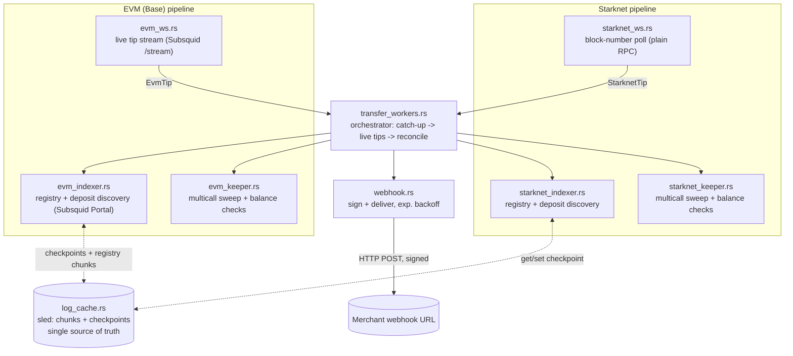
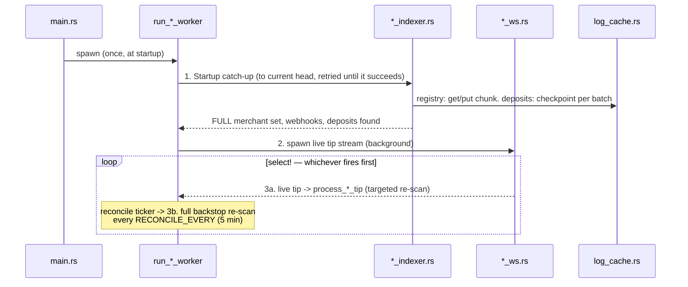
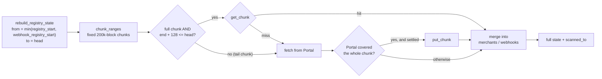

# Beanie Keeper

A Rust service that watches Base (EVM) and Starknet for merchant deposits,
sweeps them, and delivers signed webhooks — as two independent, isolated
pipelines sharing one on-disk checkpoint store.

---

## Overview

The keeper does three things per chain, forever:

1. **Discover** merchant/webhook registry events and deposit events.
2. **Sweep** any receiver with a nonzero balance.
3. **Notify** the merchant's webhook URL, signed, with retries.

EVM and Starknet run as two fully independent loops inside one process.
Neither chain's failures, backlogs, or rate limits affect the other — they
only share `LogCache`, the durable checkpoint store, because both write to
the same sled database file.

## Architecture



## Project structure

```text
src/
├── main.rs              # HTTP API (axum) + spawns all background workers
├── lib.rs               # crate root — module list below
├── config.rs             # env loading: EvmConfig, StarknetConfig, Deposit
├── transfer_workers.rs   # orchestrator — see "Transfer worker" below
├── evm_ws.rs             # live EVM tips via Subsquid Portal /stream (NDJSON)
├── evm_indexer.rs        # EVM registry (full rebuild from cached chunks) + deposit discovery, Subsquid Portal HTTP
├── evm_keeper.rs         # EVM client, multicall sweep, balance checks
├── starknet_ws.rs        # live Starknet tips (plain block-number poll)
├── starknet_indexer.rs   # Starknet registry + deposit discovery
├── starknet_keeper.rs    # Starknet account, multicall sweep, balance checks
├── log_cache.rs          # sled-backed chunk store + checkpoint store (shared)
└── webhook.rs            # signs (EIP-191 / Starknet-Poseidon) and delivers
```

---

## The transfer worker

`transfer_workers::run_native_transfer_poller` is the entry point spawned
once from `main.rs`. It runs two independent loops concurrently
(`tokio::join!`), one per chain — `run_evm_worker` and
`run_starknet_worker` — each following the same three-phase shape:



**Phase 1 — startup catch-up.** `run_evm_catchup` / `run_starknet_catchup`
bring the worker's in-memory state up to the current chain head *before*
any live tip is processed.

For EVM this is two ordered steps:

1. **Registry rebuild** (`rebuild_registry_state`). Reconstructs the
   *complete* merchant → receiver set and webhook map from chain history,
   reading finished chunks from `LogCache` and fetching only what isn't
   cached yet (details in
   [How EVM registry state survives a restart](#how-evm-registry-state-survives-a-restart)).
2. **Deposit scan** from the `evm:deposits:v2` checkpoint up to the block the
   registry is known through, filtered by the *full* receiver set.

If EVM catch-up fails, the worker **retries with backoff (5s → 60s cap)
and does not start the live loop until it succeeds.** Starting live with
an empty receiver map would make every tip skip its deposit scan silently.

Starknet catch-up scans from the last durable checkpoint (or the
configured start block on first run) up to head in bounded chunks,
committing each chunk's progress the moment it's fetched, so a crash or a
rate-limit failure partway through never re-does already-paid-for work.

**Phase 2 — live tips.** `evm_ws.rs` / `starknet_ws.rs` push a `Tip`
(`block_number` + activity flags) into a bounded channel every time a new
block appears. Each tip triggers a *targeted* re-scan — the registry scan
only runs if there's real backlog or an activity flag says something
happened in that block, and deposits are checked against whatever receiver
set is currently known. This is the low-latency path: usually one block's
worth of work, not a full re-scan.

**Phase 3 — reconciliation backstop.** Independent of tips, a ticker fires
every `RECONCILE_EVERY` (5 minutes) and forces a full re-scan regardless of
what the live stream reported. This exists specifically to bound the
damage of a missed or delayed tip (a stream reconnect, a dropped
notification) — worst case, a deposit is picked up 5 minutes late, never
lost.

### How EVM registry state survives a restart

A checkpoint records **how far** a scan got, not **what it found**. The
live path resumes registry discovery from the checkpoint, so on its own it
only ever returns what was registered *since the last run* — usually
nothing. But the deposit filter (Transfer logs whose indexed `to` is one of
our receivers) and the live `merchant_map` both need **every** receiver.
Rebuilding them from the checkpoint alone produced an empty receiver set
after every restart, which meant no deposits were discovered, swept, or
notified.

So the registry results are stored in `LogCache`'s chunk store, not just
the checkpoint:



| Rule | Why |
|---|---|
| Chunks come from `chunk_ranges`, anchored at the registry start block | Boundaries are identical on every run, so `get_chunk`/`put_chunk` (which key on the exact `(start, end)`) actually hit |
| Only *full* chunks whose end is at least `REORG_SAFETY_BLOCKS` (128) behind head are cached | A shallow reorg near the tip can't leave stale logs in the cache |
| A chunk is cached only if Portal reported reaching its last block | A partial response is never treated as complete |
| The partial tail chunk near head is always re-fetched, never cached | Its boundaries change every run; it's at most one 200k-block request |
| Scan ID includes the factory and webhook-registry addresses | Chunks from a different deployment sharing the same cache path are never reused |
| Cached values are plain hex strings | `LogCache` stays free of ethers/alloy/starknet types |

Every finished chunk is written immediately, so a crash halfway through a
first-run rebuild keeps everything already fetched. Later restarts read
cached chunks straight from sled with no network calls.

After the rebuild, the `evm:registry_webhook` checkpoint is moved forward
(never backwards) so the live path only scans what comes after it, and
deposits are scanned only up to `scanned_to` — the block the registry is
known through — so a receiver can never be missing from the filter for a
range that then gets marked as scanned.

### Why one shared `LogCache`, not per-chain in-memory watermarks

Registry/deposit progress lives **only** in `log_cache.rs`'s sled trees —
never in an in-memory struct field on the EVM or Starknet worker state.
Reasons:

- **Crash safety.** An in-memory watermark resets on restart; the sled
  checkpoint doesn't. There's exactly one place to ask "how far did this
  scan get," so there's never a question of which of two copies is right.
- **Per-chunk durability.** A chunked backfill over tens of thousands of
  blocks that fails on chunk 401 of 3,000 doesn't retry chunks 1–400 — the
  checkpoint already advanced past them.
- **Results, not just position.** For the EVM registry, each chunk's
  decoded *results* are stored too (`put_chunk`), because the in-memory
  receiver set has to be rebuilt after a restart and a bare checkpoint
  can't tell you what was found before it. Deposit scanning stays
  checkpoint-only: its results depend on the receiver set at the time, so
  replaying cached deposit chunks wouldn't be safe. Its checkpoint is
  written **once, after the scan returns** (not per HTTP batch): the
  deposits found are only handed back at the end, so a checkpoint that ran
  ahead of them would let a stopped run skip deposits nobody had swept or
  notified.

### Chain isolation

EVM and Starknet are scanned, swept, and notified by fully separate code
paths (`evm_*` vs `starknet_*`, distinct `mpsc` channels, distinct
`EvmState`/`StarknetState`). A Subsquid Portal outage on the EVM side does
not block Starknet deposit processing, and vice versa. The only thing they
share is the sled file underneath `LogCache`, keyed by distinct scan IDs
(`evm:registry_webhook`, `evm:deposits:v2`, the per-deployment
`evm:registry_chunks:{factory}:{webhook_registry}` chunk namespace, and
the Starknet equivalents) so the two chains' checkpoints and chunks can
never collide.

---

## Webhook delivery

`webhook.rs` signs every payload with the keeper's own key — EIP-191
`personal_sign` for EVM, Poseidon-hashed Starknet signing for Starknet —
and delivers it with exponential backoff (100ms → 3s cap, up to
`max_retries` attempts). A `4xx` response is treated as terminal (the
merchant's endpoint rejected the payload; retrying won't help) and returned
immediately rather than retried. The signer address is deterministic from
`chain_id` (`base` → EIP-191, Starknet → Poseidon), so a merchant only ever
needs to verify against one address they already recognize from sweep
transactions.

---

## Environment configuration

### Base (EVM)

| Variable | Purpose |
|---|---|
| `BASE_RPC_URL` | RPC for state reads and sending sweep transactions |
| `BASE_WS_URL` | *Optional* — only feeds a minor `base_fee_per_gas` optimization |
| `BASE_TOKEN_ADDRESS` | The ERC-20 being swept |
| `BASE_FACTORY_ADDRESS` | Merchant factory / registry contract |
| `BASE_REGISTRY_START_BLOCK` | Registry scan start (first run only) |
| `BASE_WEBHOOK_REGISTRY_ADDRESS` | Webhook-URL registry contract |
| `BASE_WEBHOOK_REGISTRY_START_BLOCK` | Webhook registry scan start |
| `BASE_DEPOSIT_START_BLOCK` | Deposit scan start |
| `BASE_SWEEP_PRIVATE_KEY` | Keeper wallet — signs both sweeps and webhooks |
| `BASE_SUBSQUID_PORTAL_URL` | **Required.** Event discovery source, e.g. `https://portal.sqd.dev/datasets/base-mainnet` |
| `BASE_SUBSQUID_PORTAL_API_KEY` | **Required.** From <https://portal.sqd.dev/> |
| `BASE_POLL_INTERVAL_SECS` | Default `12` |

### Starknet

| Variable | Purpose |
|---|---|
| `STARKNET_RPC_URL` | Provider for state reads and sweep transactions |
| `STARKNET_SWEEP_PRIVATE_KEY` | Keeper signing key (raw felt scalar hex) |
| `STARKNET_TOKEN_ADDRESS` / `STARKNET_FACTORY_ADDRESS` / `STARKNET_KEEPER_ADDRESS` | Felt-encoded contract/account addresses |
| `STARKNET_REGISTRY_START_BLOCK` / `STARKNET_DEPOSIT_START_BLOCK` / `STARKNET_WEBHOOK_REGISTRY_START_BLOCK` | Scan start blocks |
| `STARKNET_EVENT_STREAM_URL` | Event discovery source |
| `STARKNET_EVENT_API_KEY` | *Optional* |
| `STARKNET_POLL_INTERVAL_SECS` | Default `12` |

There is no fallback event-discovery path on either chain — Subsquid
Portal (EVM) and the configured event stream (Starknet) are the only
sources; `evm_rpc_url` / `rpc_url` are used exclusively for state reads and
sending transactions, never for log discovery.

---

## Building & running

```bash
cargo build --release
cp .env.example .env   # fill in the variables above
cargo run --release
```

### As a library

```toml
[dependencies]
beanie_keeper = { path = "../beanie_keeper" }
```

```rust
use beanie_keeper::config::Deposit;

let deposit = Deposit {
    tx_hash: tx_hash.clone(),
    from_address: task.from_address.clone(),
    receiver: format!("{:?}", receiver_addr),
    amount_raw: task.amount_raw.clone(),
    block_number: receipt.block_number.map(|b| b.as_u64()).unwrap_or(0),
};
```

---

## Operational notes

- **Rate limiting:** Subsquid Portal requests (both the catch-up scans in
  `evm_indexer.rs` and the live stream in `evm_ws.rs`) share one rate
  limiter (`SQD_RATE_LIMITER`, 20-50 req/10s) — they are coordinated
  consumers of the same budget, not independent callers.
- **Reconnects back off exponentially** (1s → 60s cap) rather than
  retrying on a fixed interval, so a Portal outage doesn't turn into a
  sustained request storm.
- **Idle live stream waits 1s.** When Portal has nothing new (204 / empty
  body — the worker is at head), `evm_ws.rs` sleeps 1s before polling
  again instead of re-polling immediately. A tight loop there used up the
  shared limiter that the deposit scans also need. If the last poll
  *did* deliver blocks, it re-polls immediately.
- **Deposit scan window is 20,000 blocks** (`DEPOSIT_MAX_BLOCKS_PER_REQUEST`),
  halving down to 1,000 on Portal timeouts and growing back after 5
  successes. At 1,000 blocks/request the shared 2 req/s limiter plus a
  per-batch pause capped throughput near ~750 blocks/sec — hours per ten
  million blocks on a first backfill. `BASE_DEPOSIT_START_BLOCK` should be
  no earlier than the factory's deployment block; every block before it is
  scanned for nothing.
- **EVM catch-up is retried, not skipped.** See Phase 1: the live loop
  never starts with an empty receiver map.
- **The reconciliation ticker's first tick is delayed by a full
  `RECONCILE_EVERY`**, not fired immediately at startup — the startup
  catch-up (Phase 1) already did that work once; re-running it a few
  hundred milliseconds later would just race the checkpoint that catch-up
  is still writing.

---

## Troubleshooting (EVM)

Healthy startup logs, in order:

```text
Rebuilding EVM registry state: blocks A..=B
Registry rebuild COMPLETE: N merchant/receiver pair(s), M webhook(s), through block B (X chunk(s) from cache, Y fetched)
EVM catch-up: N receiver(s) known through block B
Catching up on Beanie EVM Deposits started (N receiver(s)), this may take a while
EVM worker state ready: N receiver(s), M webhook(s)
```

| What you see | Meaning |
|---|---|
| `Beanie EVM deposit scan skipped: no receivers known` | The registry rebuild found no merchants. Check the start-block env vars and the event decoding (see below) |
| `X chunk(s) from cache` is `0` on the first run after this change | Expected — nothing was chunk-cached before (the Portal indexer used to store only checkpoints). Later runs should show cache hits |
| `Registry chunk i/n ... not cached, fetching` | Registry rebuild progress. Percentages in the `evm:registry_webhook: block ...` lines are **per chunk**, so they reset to 0% for each one |
| `evm:deposits:v2: block X of Y (Z%)` runs for a long time | First-ever deposit backfill from `BASE_DEPOSIT_START_BLOCK`. Compare `blocks/sec` and `window` in that line: ~750 blocks/sec with window 1000 is the old slow behavior |
| `EVM startup catch-up failed: ... retrying in ...` | Portal/RPC trouble at startup; the worker waits and retries rather than going live with an empty state |
| `registry rebuild made no progress` | Portal returned no blocks for the requested range (usually not ingested yet); it retries |
| `unreadable cached registry chunk ... refetching` | Cached chunk didn't deserialize (format change); it's refetched and rewritten |
| No EVM lines at all after startup | Live tips are flowing but nothing is due. Set `RUST_LOG=debug` to see per-tip `no receivers in merchant_map` messages |

If `N` is `0` even though merchants exist, check that `MerchantRegistered`
carries the receiver in `data`: the decoder expects that layout and
silently skips the log if the receiver is an indexed topic instead.
